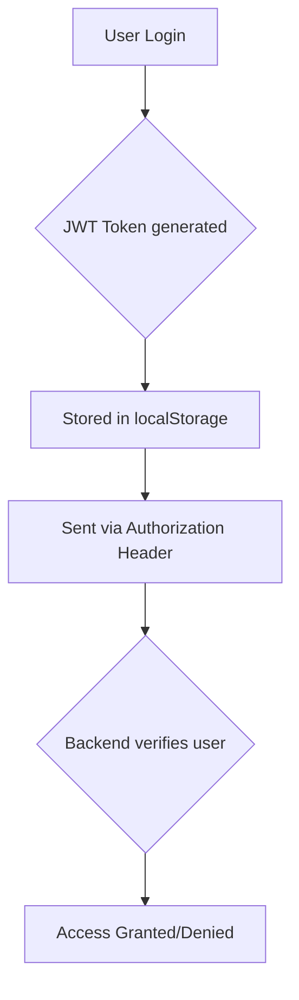
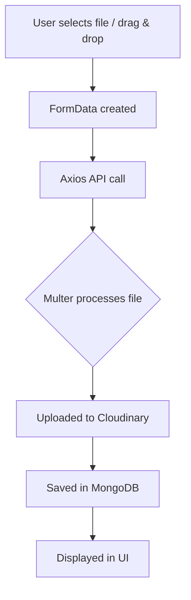

# 🚀 FileFlow - Full Stack File Management System

FileFlow is a robust, full-stack web application designed for efficient file management. It empowers users to securely upload, organize, and manage their digital assets with ease, featuring comprehensive authentication, seamless cloud storage integration, and a modern, intuitive user interface with drag-and-drop functionality.

---

## ✨ Key Features

FileFlow offers a comprehensive suite of features to streamline file management:

- **🔐 Secure User Authentication:** Implements a robust signup and login system utilizing JSON Web Tokens (JWT) for secure access control.
- **📂 Intuitive File Uploads:** Supports effortless file uploads with convenient drag-and-drop functionality for an enhanced user experience.
- **☁️ Scalable Cloud Storage:** Integrates with Cloudinary to provide reliable and scalable cloud storage for all user files.
- **📋 Dynamic Dashboard:** Presents an organized dashboard for users to view and manage their uploaded files efficiently.
- **🗑️ File Operations:** Allows users to easily delete and update (replace) existing files.
- **🖼️ Image Previews:** Provides interactive image previews, enabling users to view full-screen versions of their images.
- **🔒 Protected Routes:** Ensures secure access to sensitive application areas through protected routes.
- **⚡ Real-time UI Updates:** Delivers a responsive and dynamic user experience with real-time updates to the user interface.

---

## 🛠️ Technology Stack

FileFlow is built using a modern and powerful technology stack, ensuring performance, scalability, and maintainability.

| Category          | Technology         | Description                                   |
| :---------------- | :----------------- | :-------------------------------------------- |
| **Frontend**      | React (Vite)       | Fast and efficient UI development             |
|                   | React Router DOM   | Declarative routing for React applications    |
|                   | Axios              | Promise-based HTTP client for API requests    |
| **Backend**       | Node.js            | High-performance JavaScript runtime           |
|                   | Express.js         | Fast, unopinionated, minimalist web framework |
|                   | MongoDB (Mongoose) | NoSQL database with elegant ODM for Node.js   |
| **Cloud & Tools** | Cloudinary         | Cloud-based image and video management        |
|                   | JWT                | JSON Web Tokens for secure authentication     |
|                   | Multer             | Middleware for handling `multipart/form-data` |

---

## 📁 Project Structure

```
FileFlow/
│
├── frontend/                 # React application for the user interface
│   ├── src/
│   │   ├── components/       # Reusable UI components
│   │   ├── pages/            # Application pages/views
│   │   ├── services/         # API service integrations
│   │   └── App.jsx           # Main application component
│
├── backend/                  # Node.js/Express.js API server
│   ├── controller/           # Business logic and request handlers
│   ├── routes/               # API endpoints definitions
│   ├── models/               # MongoDB data models (Mongoose schemas)
│   ├── middleware/           # Express middleware for authentication, error handling, etc.
│   └── server.js             # Entry point for the backend server
```

---

## ⚙️ Installation & Setup

To get a local copy of FileFlow up and running, follow these steps:

### 1. Clone the Repository

```bash
git clone https://github.com/your-username/fileflow.git
cd fileflow
```

### 2. Backend Setup

Navigate to the `backend` directory and install dependencies:

```bash
cd backend
npm install
```

Create a `.env` file in the `backend` directory with the following environment variables:

```dotenv
PORT=5000
MONGO_URI=your_mongodb_uri_here
JWT_SECRET=your_jwt_secret_key_here
CLOUDINARY_CLOUD_NAME=your_cloudinary_cloud_name_here
CLOUDINARY_API_KEY=your_cloudinary_api_key_here
CLOUDINARY_API_SECRET=your_cloudinary_api_secret_here
```

Replace the placeholder values with your actual MongoDB URI, JWT secret, and Cloudinary credentials. You can obtain these from MongoDB Atlas and Cloudinary.

Start the backend server:

```bash
npm run dev
```

### 3. Frontend Setup

Navigate to the `frontend` directory and install dependencies:

```bash
cd ../frontend
npm install
```

Start the frontend development server:

```bash
npm run dev
```

The application should now be running locally, accessible via your browser (typically `http://localhost:5173` for the frontend and `http://localhost:5000` for the backend API).

---

## 🚀 Live Demo & Screenshots

**Live Demo:**
 https://fileflow-5ed5.onrender.com/
 

Visual demonstrations are crucial. Please add screenshots or a short GIF/video showcasing the application's key features, such as the dashboard, file upload process, and image preview.

- **Dashboard View:** [Screenshot 1 Link]
- **File Upload in Progress:** [Screenshot 2 Link]
- **Image Preview:** [Screenshot 3 Link]

---

## 💡 System Architecture & Flow Diagrams

Understanding the system's core processes is vital. Below are diagrams illustrating the authentication and file upload workflows.

### Authentication Flow



### File Upload Flow



---

## 📈 Future Enhancements

We are continuously working to improve FileFlow. Planned enhancements include:

- **📊 Upload Progress Bar:** Provide real-time feedback on file upload status.
- **📁 Advanced Folder System:** Implement hierarchical folder structures for better organization.
- **🔍 Search & Filter Functionality:** Enable users to quickly find files using search queries and filters.
- **📎 Secure File Sharing:** Develop a system for sharing files securely with other users.
- **🎨 UI/UX Refinements:** Continuously improve the user interface and overall user experience.

---

## 🧑‍💻 Author

**Abhishek Kumar**

 www.linkedin.com/in/abhishek-kumar-792a45288 
 https://github.com/abhi281500
https://x.com/Abhishe57561034
---

## ⭐ Show Your Support

If you find this project useful or interesting, please consider giving it a star ⭐ on GitHub! Your support is greatly appreciated.

---

## 📄 License

This project is licensed under the [MIT License](https://opensource.org/licenses/MIT). See the `LICENSE` file for more details.

---

## Acknowledgments

- [Best-README-Template](https://github.com/othneildrew/Best-README-Template) for inspiration on README structure.
- 
